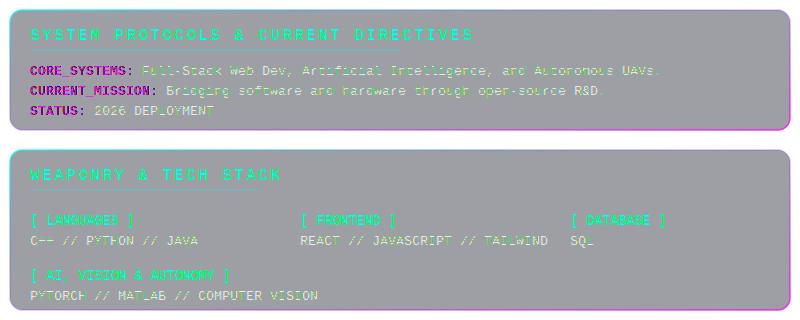
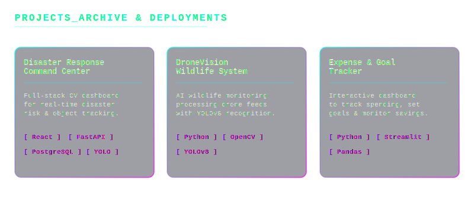

<!-- Animated Header -->

<!-- Profile & Focus Glasscard -->

 

<!-- Tech Stack Logos -->

 
 

<!-- Featured Projects Glasscards -->

 
 

### 📊 GitHub Stats & Analytics

<!-- GitHub Streak (The only reliable stat card) -->

  

