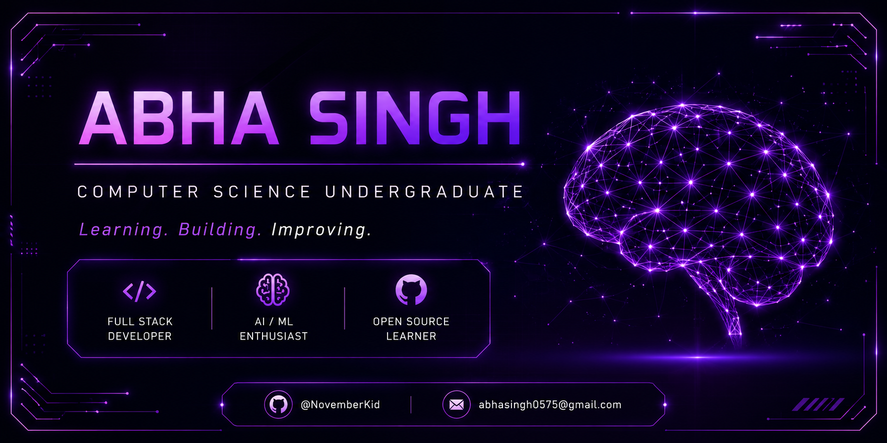

  

# Hi, I'm Abha

Computer Science undergraduate with a passion for building software that solves real-world problems.

I enjoy developing full-stack applications, exploring AI-powered systems, solving Data Structures & Algorithms problems, and contributing to open source while continuously improving my engineering skills.

## Currently

- Building full-stack projects with React and FastAPI
- Learning Data Structures & Algorithms in C++
- Exploring Computer Vision and AI
- Preparing for Google Summer of Code (GSoC)
